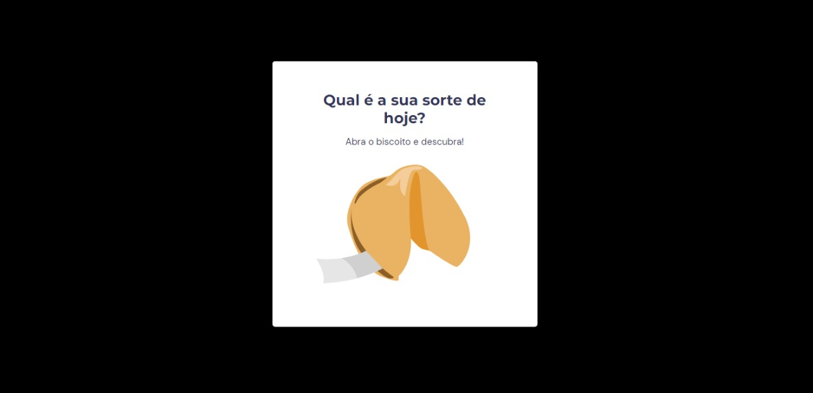
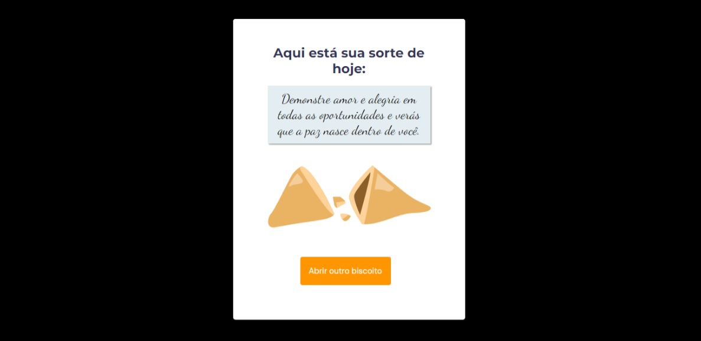

# Stage 5 - Desafio Biscoito da sorte

Nesse desafio foi criarmos um biscoito da sorte gerando mensagens aleatórias. Aplicando conceitos de HTML,CSS e JAVASCRIPT.

<legend>Imagem do projeto conlcuído </legend>

### Tecnologias usadas:

<li>HTML
<li>CSS
<li>JAVASCRIPT
